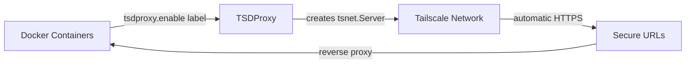

# TSDProxy - Tailscale Docker Proxy

**The easiest way to expose Docker containers on your Tailscale network. One label. Zero sidecars.**

[](https://github.com/almeidapaulopt/tsdproxy/stargazers)
[](https://github.com/almeidapaulopt/tsdproxy/issues)
[](https://hub.docker.com/r/almeidapaulopt/tsdproxy)
[](LICENSE)
[](https://go.dev/)
[](https://github.com/almeidapaulopt/tsdproxy/releases)

<div align="center">
  <!-- Replace with demo GIF: docker compose up → containers appear in Tailscale admin → HTTPS URL loads -->
  
</div>

## Quick Start

Get running in under a minute. One compose file, one label.

**Step 1: Create `docker-compose.yml`**

```yaml
services:
  tsdproxy:
    image: almeidapaulopt/tsdproxy:2
    volumes:
      - /var/run/docker.sock:/var/run/docker.sock
      - tsdproxy-data:/data
      - ./config:/config
    ports:
      - "8080:8080"
    extra_hosts:
      - "host.docker.internal:host-gateway"
    restart: unless-stopped

  myapp:
    image: nginx:alpine
    labels:
      tsdproxy.enable: "true"
      tsdproxy.name: "myapp"

volumes:
  tsdproxy-data:
```

**Step 2: Start it up**

```bash
docker compose up -d
```

TSDProxy creates a default config at `/config/tsdproxy.yaml` on first run. Open the dashboard at `http://localhost:8080`, click the proxy card, and authenticate with Tailscale.

Your container is now available at `https://myapp.<tailnet-name>.ts.net` with automatic HTTPS.

For automated (headless) setup, configure an [AuthKey or OAuth](https://almeidapaulopt.github.io/tsdproxy/docs/advanced/tailscale/) before adding services.

## Key Features

| Feature | Description |
|---------|-------------|
| Zero sidecars | No Tailscale container needed per service. One proxy handles everything. |
| Label-based config | Add `tsdproxy.enable=true` to any container. Done. |
| Automatic HTTPS | Tailscale provisions Let's Encrypt certs for every machine. |
| Multi-port support | Expose multiple ports per container with granular protocol control. |
| TCP & UDP proxying | Proxy TCP (SSH, databases) and UDP traffic alongside HTTP/HTTPS services. |
| Port ranges | Define ranges of ports in a single label — e.g. `2222-2230/tcp`. |
| Funnel support | Expose services to the public internet with `tailscale_funnel` option. |
| Health monitoring | Automatic backend health probes with recovery and target re-resolution. |
| Webhook notifications | Push proxy events to ntfy, Discord, Slack, Gotify, or generic webhooks. |
| REST API | Programmatic control over proxies — pause, resume, and manage via API. |
| Role-based access | Admin and viewer roles with optional admin allowlist. |
| Dynamic lifecycle | Containers start and stop. Tailscale machines appear and disappear. |
| Live config reload | Change settings without restarting TSDProxy. |
| Dashboard | Real-time web UI with SSE streaming, access logs, and status timeline. |
| List provider | Expose non-Docker services via a simple YAML file. |

## How It Works



Under the hood:

1. **Container Scanning** - TSDProxy watches your Docker daemon for containers tagged with `tsdproxy.enable=true`.
2. **Machine Creation** - When a tagged container appears, TSDProxy spins up a Tailscale machine via `tsnet`.
3. **Hostname Assignment** - The machine gets a hostname from the `tsdproxy.name` label or the container name.
4. **Port Mapping** - TSDProxy maps the container's internal port to the Tailscale machine.
5. **Traffic Routing** - Incoming requests to `https://myapp.<tailnet>.ts.net` are reverse-proxied to the container.
6. **Dynamic Cleanup** - When a container stops, its Tailscale machine and routes are removed automatically.

## Port Configuration

Expose multiple ports with per-port protocol and options:

```yaml
labels:
  tsdproxy.enable: "true"
  tsdproxy.name: "myservice"

  # HTTPS on 443 -> container port 80
  tsdproxy.port.1: "443/https:80/http"

  # HTTP on 80 -> container port 8080
  tsdproxy.port.2: "80/http:8080/http"

  # HTTP redirect to HTTPS
  tsdproxy.port.3: "81/http->https://myservice.tailnet.ts.net"

  # TCP proxy for SSH
  tsdproxy.port.4: "22/tcp:22/tcp"

  # UDP proxy (e.g. game server, VoIP)
  tsdproxy.port.5: "5060/udp:5060/udp"

  # Port range (TCP ports 2222 through 2230)
  tsdproxy.port.6: "2222-2230/tcp:2222-2230/tcp"
```

## Docker Images

| Tag | Description |
|-----|-------------|
| `almeidapaulopt/tsdproxy:2` | Latest v2 release |
| `almeidapaulopt/tsdproxy:latest` | Latest stable release |
| `almeidapaulopt/tsdproxy:dev` | Latest development build |
| `almeidapaulopt/tsdproxy:vx.x.x` | Specific version |

## Documentation

Full setup guides, configuration reference, and advanced usage:

**[almeidapaulopt.github.io/tsdproxy](https://almeidapaulopt.github.io/tsdproxy/)**

Key docs: [Getting Started](https://almeidapaulopt.github.io/tsdproxy/docs/getting-started/) | [Docker Labels](https://almeidapaulopt.github.io/tsdproxy/docs/providers/docker/) | [Port Configuration](https://almeidapaulopt.github.io/tsdproxy/docs/providers/docker/#port-configuration) | [List Provider](https://almeidapaulopt.github.io/tsdproxy/docs/providers/lists/) | [TCP Proxy](https://almeidapaulopt.github.io/tsdproxy/docs/advanced/tcp-proxy/) | [Funnel](https://almeidapaulopt.github.io/tsdproxy/docs/security/funnel/) | [REST API](https://almeidapaulopt.github.io/tsdproxy/docs/operations/api/) | [Health Checks](https://almeidapaulopt.github.io/tsdproxy/docs/operations/health-check/) | [Webhooks](https://almeidapaulopt.github.io/tsdproxy/docs/notifications/) | [Admin Allowlist](https://almeidapaulopt.github.io/tsdproxy/docs/security/admin-allowlist/) | [Upgrading from v1](https://almeidapaulopt.github.io/tsdproxy/docs/upgrading/from-v1/)

## Contributing

Bug reports, feature requests, documentation improvements, and pull requests are all welcome. See [CONTRIBUTING.md](CONTRIBUTING.md) for guidelines.

If you'd rather support the project financially, [sponsorships](https://github.com/sponsors/almeidapaulopt) help keep development going.

## License

This project is licensed under the MIT License. See the [LICENSE](LICENSE) file for details.

---

[](https://star-history.com/#almeidapaulopt/tsdproxy&Date)
